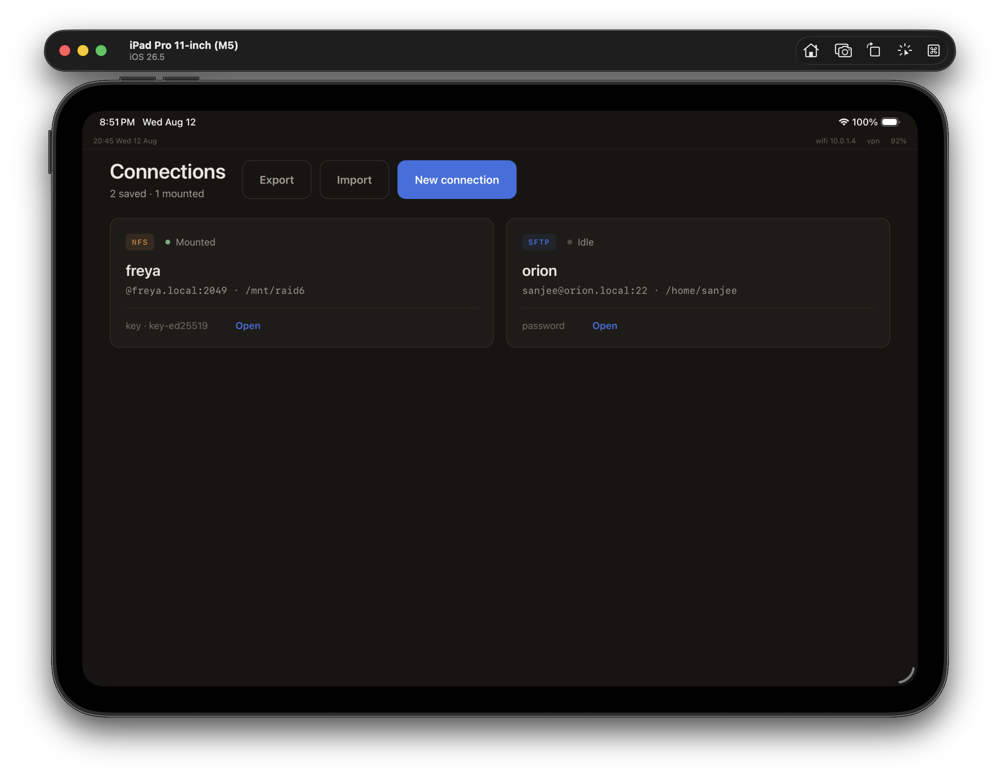
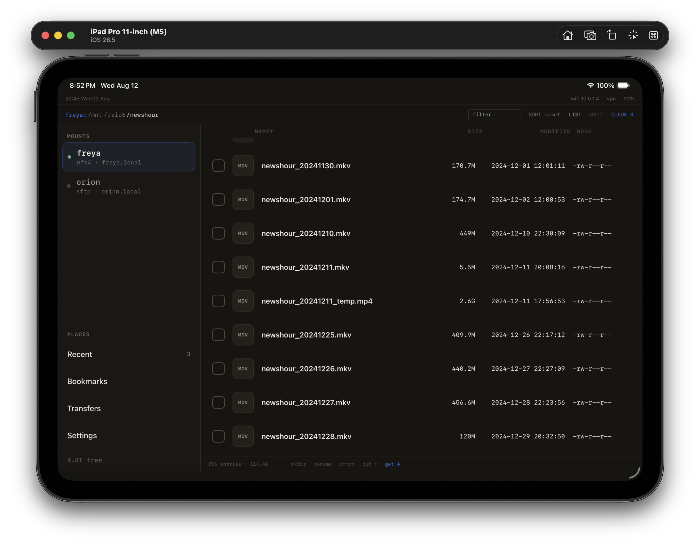
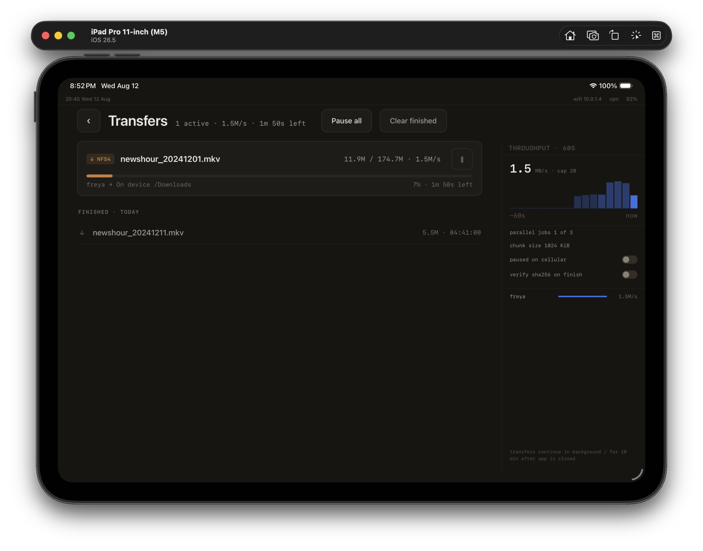
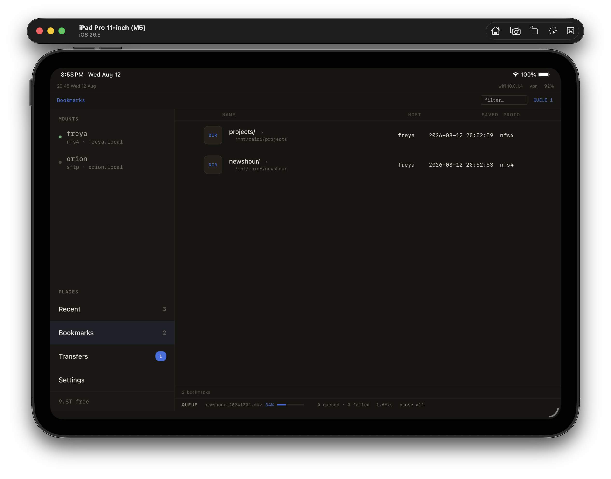
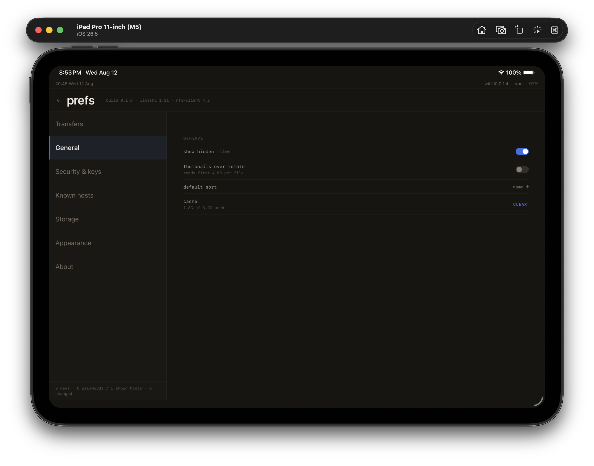

<p align="center">
  
</p>

<h1 align="center">mKestrel</h1>

<p align="center">
  A touch-first SFTP and NFS client for iPad, Android, and desktop.<br>
  Browse remote filesystems, transfer with a live queue, and keep bookmarks across devices.
</p>

## Screenshots

### Connections



Saved hosts with protocol, endpoint, and mount state. Export and import a portable config (hosts, settings, bookmarks — no secrets).

### File browser



Path bar, mounts rail, and a sortable listing. Long-press a row for download, play, rename, delete, or add bookmark.

### Transfers



Active jobs as cards with progress, rate, and pause. Queued and finished items sit in a flat list below.

### Bookmarks



Pinned files and folders, plus Recent. Tap a bookmark to jump back to that host and path.

### Settings



Transfers, browsing, keys, and known hosts.

## Highlights

- **SFTP and NFSv3** in one rail, plus a local file backend
- **Recent** and **Bookmarks** as first-class places
- **Transfer queue** with pause, retry, resume, and optional SHA-256 verify
- **Play** media over a loopback stream (desktop)
- **Portable config** for moving hosts and bookmarks between devices
- Secrets stay out of the JSON store; host keys can be reviewed on first contact

## Build

See [docs/dev-setup.md](docs/dev-setup.md) for toolchains, iOS/Android targets, and the desktop loop.

```sh
# desktop, fixture data, no network
cargo run -p mkestral -- --demo

# iPad simulator (release)
scripts/bundle-ios-sim.sh booted release
```
